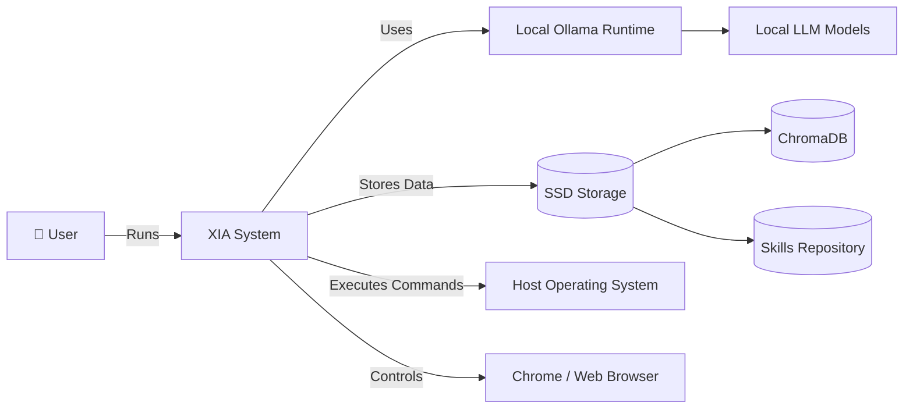
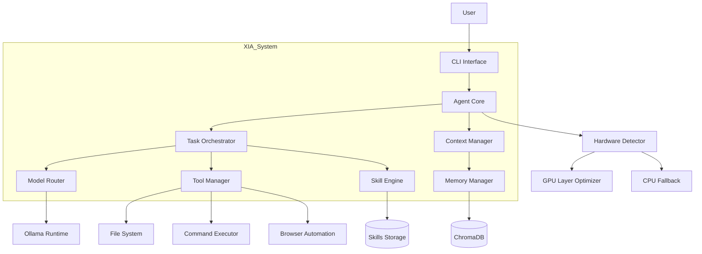
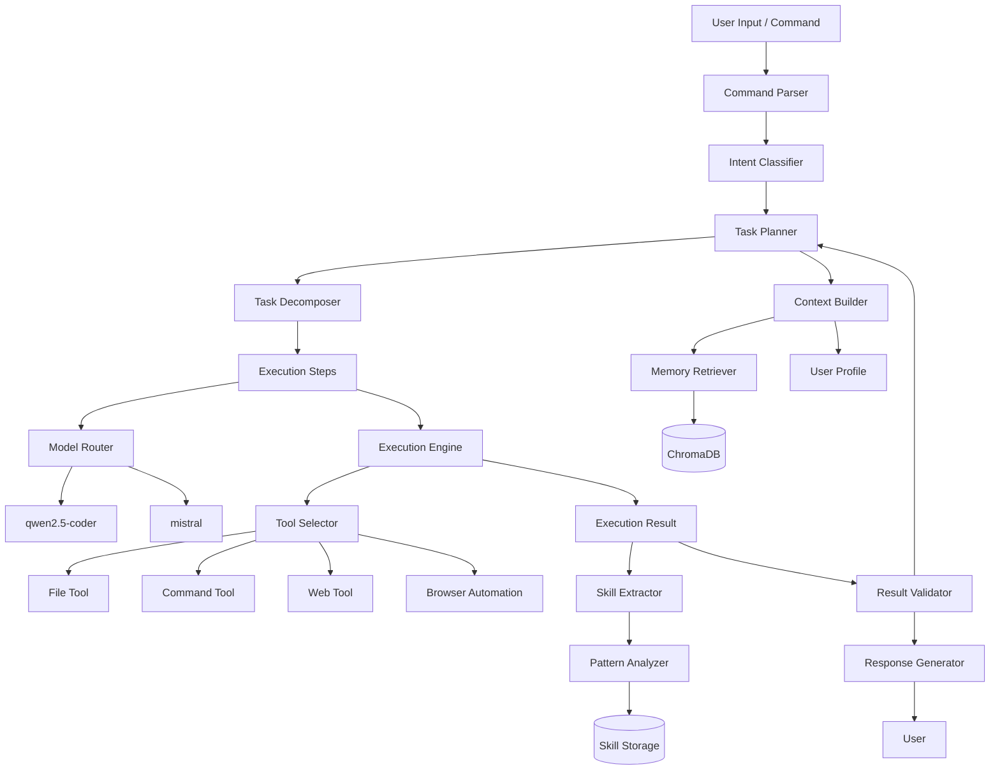

# 🚀 XIA — eXtremely Intelligent Assistant


> ⚡ A self-bootstrapping, portable AI agent that runs entirely from an external SSD.
> Plug in. Double-click. Your personal AI is ready anywhere.

---

## ⚡ Quick Start

```bash
# 1. Plug in your SSD
# 2. Double-click launch.bat
# 3. That's it
```

First run:

* Installs Python, Ollama, dependencies
* Downloads models (~4GB)

Next runs:

* Start instantly ⚡

---

## 🧠 What XIA Can Do

* 💬 **Talk** — local LLM (Ollama), fully offline
* 🧠 **Remember** — persistent memory via ChromaDB
* ⚡ **Act** — files, commands, automation
* 🌐 **Browse** — real Chrome control (Playwright)
* 🧩 **Solve** — autonomous LeetCode agent (debug + retry loop)
* 📚 **Learn** — extracts reusable skills automatically
* ⚙️ **Adapt** — GPU/CPU aware model routing

---

## 🏗️ Architecture (C4 Model)
XIA follows a layered, modular architecture inspired by modern agent systems and C4 modeling methodology.

Below are system-level, container-level, and component-level diagrams.

---

## 🏗️ **Level 1 — System Context Diagram**

> Shows how XIA interacts with the outside world



---

## 🧱 **Level 2 — Container Diagram**

> Breaks XIA into major containers (services/modules)



---

## ⚙️ **Level 3 — Component Diagram (Core Brain)**

> Deep dive into the Agent Core (this is where you flex 💀)



## ⚙️ Setup After Cloning

```bash
# Copy env template
cp .env.example .env

# Add optional API keys
TAVILY_API_KEY=...
SERPAPI_KEY=...

# Run system
launch.bat
```

Browser setup:

```bash
.venv\Scripts\python install_browser.py
```

---

## 📦 Project Structure

```
xia/
├── launch.bat                  # Entry point — double-click this
├── launch.py                   # Bootstrap: venv · deps · GPU · Ollama · health
├── main.py                     # Application entry point
├── config.yaml                 # All configuration
├── .env.example                # API key template (copy to .env)
│
├── core/                       # System foundation
│   ├── config.py               # Typed config loader
│   ├── paths.py                # Drive-letter agnostic path resolution
│   ├── logger.py               # Rotating file + console logging
│   ├── llm.py                  # Ollama client (streaming, history, JSON mode)
│   ├── prompt.py               # System prompt builder
│   ├── router.py               # Auto model-routing per task type
│   ├── health.py               # Startup health checks
│   ├── host.py                 # GPU/CPU/RAM detection
│   └── errors.py               # Structured error types
│
├── agent/                      # Reasoning engine
│   ├── agent.py                # THINK → PLAN → ACT → OBSERVE loop
│   ├── session.py              # Session manager + chat/agent routing
│   └── base.py                 # AgentStep · AgentResult · ToolCall types
│
├── tools/                      # Agent capabilities
│   ├── registry.py             # Tool registration + fuzzy name matching
│   ├── base.py                 # BaseTool contract
│   ├── filesystem.py           # Read · write · list · delete (sandboxed)
│   ├── terminal.py             # Shell commands with timeout + blocklist
│   ├── search.py               # Web search (Tavily / SerpAPI / DuckDuckGo)
│   ├── fetch.py                # Full page text extraction
│   ├── browser.py              # Playwright Chrome automation
│   └── leetcode.py             # LeetCode solve · debug · search loop
│
├── memory/                     # Persistent intelligence
│   ├── store.py                # ChromaDB vector store
│   ├── embedder.py             # sentence-transformers (all-MiniLM-L6-v2)
│   ├── extractor.py            # LLM-based fact extraction from sessions
│   └── manager.py              # High-level memory interface
│
├── skills/                     # Learned capabilities
│   ├── schema.py               # Skill data type
│   ├── store.py                # JSON file store + index
│   ├── extractor.py            # Auto-extract skills from successful tasks
│   └── manager.py              # Retrieve + inject skills into prompts
│
├── interface/                  # Terminal UI
│   ├── cli.py                  # Main interactive loop + all /commands
│   ├── renderer.py             # Rich-based output (steps · answers · tables)
│   └── theme.py                # Colours · icons · styles
│
├── models/
│   └── model_config.yaml       # Model registry (weights NOT stored here)
│
├── data/                       # Persistent data — not committed to git
│   ├── conversations/          # Session transcripts (JSON)
│   ├── embeddings/             # ChromaDB vector database
│   └── skills_store/           # Extracted skills (JSON)
│
├── workspace/                  # Agent's working folder for user files
└── logs/                       # Rotating runtime logs
```

---

## 🎮 CLI Commands


| Command | Description |
|---|---|
| `/memory` | Show stored memories |
| `/remember <fact>` | Manually store a memory |
| `/forget` | Clear all memories |
| `/skills` | List learned skills |
| `/tools` | List available tools |
| `/models` | Show all downloaded Ollama models |
| `/model <name>` | Switch to a specific model |
| `/profile <name>` | Switch profile: `coding` · `fast` · `smart` · `default` |
| `/save` | Save session to disk now |
| `/clear` | Clear conversation history |
| `/help` | Show all commands |

---

## 🤖 Multi-Model Routing

xia automatically picks the best available model based on the task:

| Profile | Best for | Prefers |
|---|---|---|
| `coding` | Code, algorithms, LeetCode | `qwen2.5-coder`, `deepseek-coder` |
| `fast` | Quick questions | `phi4`, `phi3` |
| `smart` | Deep reasoning | `deepseek-r1`, `llama3.1` |
| `default` | General use | `mistral`, `llama3` |

Pull any model and xia will start using it automatically:
```bash
ollama pull qwen2.5-coder
ollama pull phi4
ollama pull deepseek-r1
```

---

## 💻 System Requirements

| | Minimum | Recommended |
|---|---|---|
| OS | Windows 10 | Windows 11 |
| RAM | 8GB | 16GB+ |
| SSD free space | 30GB | 60GB+ |
| SSD interface | USB 3.0 | USB 3.1 / NVMe |
| GPU | — | Any NVIDIA (CUDA auto-detected) |
| Python | 3.11+ | 3.12 |

xia adapts to whatever hardware is available. GPU is optional — CPU-only works fine.

---

## 🧠 Design Principles

* Everything lives on the SSD
* Zero host dependency
* Self-healing startup
* Fully local-first
* No retraining required
* Fully modular architecture

---

## 🛠️ Build log

| Part | What was built |
|---|---|
| 1 | Project scaffold, SSD layout, config system, path resolution |
| 2 | Self-bootstrapping Windows launcher (venv, deps, Ollama, model pull) |
| 3 | Ollama LLM client — streaming, history, JSON mode, model switching |
| 4 | Agentic loop — THINK → PLAN → ACT → OBSERVE, session routing |
| 5 | Tool system — filesystem, terminal, tool registry, sandboxed paths |
| 6 | Web search (Tavily/DDG) + page fetcher |
| 7 | Persistent memory — ChromaDB, sentence-transformers, semantic retrieval |
| 8 | Skill system — auto-extraction, JSON store, prompt injection |
| 9 | Rich terminal UI — coloured steps, markdown panels, all /commands |
| 10 | Robustness — health checks, GPU detection, structured errors |
| 11 | Browser automation (Playwright) + LeetCode autonomous solver |
| +  | Multi-model routing — auto-pick model per task, /profile command |

---

## 🚀 What Makes XIA Different

| Feature     | Typical AI | XIA          |
| ----------- | ---------- | ------------ |
| Setup       | Manual     | One-click    |
| Memory      | Temporary  | Persistent   |
| Actions     | Limited    | Real-world   |
| Learning    | None       | Skill system |
| Portability | ❌          | ✅ SSD-based  |
| Multi-model | Rare       | Built-in     |

---

## ⚠️ Disclaimer

XIA can execute system-level commands.
Use responsibly.

---

## 📄 License

MIT

---

# 💡 Final Thought

> XIA isn’t just an AI assistant.
> It’s a **portable AI system that learns, acts, and evolves with you.**


